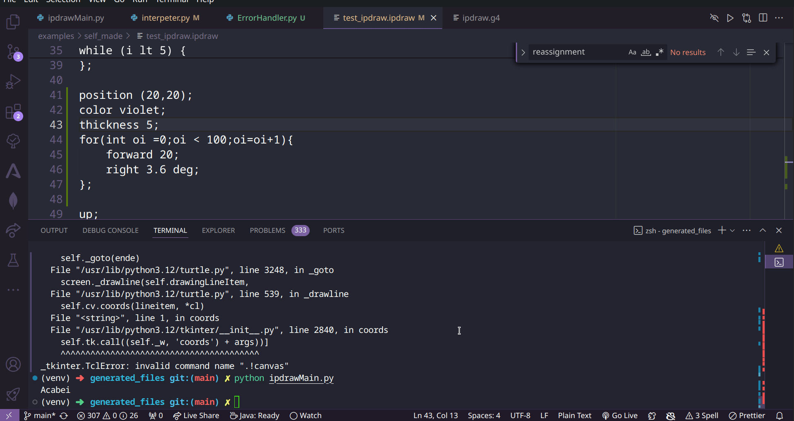

# Relatório - tema **PDraw**, grupo **pdraw-t02**

Cadeira: Compiladores

Ano Letivo: 2023/2024

O presente projeto tem como objetivo construir um compilador e um interpretador para a linguagem **PDraw** e **iPdraw**, respetivamente. A linguagem **PDraw** compila os programas **PDraw** para Python. O programa compilado pode eventualmente executar um _script_ **iPdraw** que será interpretado em tempo de execução.
Ambas as linguagens permitem aos utilizadores a criação imagens e formas, proporcionando-lhes uma tela virtual. A linguagem segue a abstração da biblioteca python `turtle`.

---

## Index

[Relatório - tema **PDraw**, grupo **pdraw-t02**](#relatório---tema-pdraw-grupo-pdraw-t02)

- [Relatório - tema **PDraw**, grupo **pdraw-t02**](#relatório---tema-pdraw-grupo-pdraw-t02)
  - [Index](#index)
  - [1. Constituição dos grupos e participação individual global](#1-constituição-dos-grupos-e-participação-individual-global)
  - [2. Como executar](#2-como-executar)
  - [3. Estrutura](#3-estrutura)
  - [4. Pdraw](#4-pdraw)
  - [5. Gramática](#5-gramática)
  - [6. Visitors](#6-visitors)
    - [Exemplo - InstructionPenAction](#exemplo---instructionpenaction)
  - [7. Variáveis, métodos, operadores e tipos de dados](#7-variáveis-métodos-operadores-e-tipos-de-dados)
    - [Variáveis e métodos](#variáveis-e-métodos)
    - [Operadores](#operadores)
    - [Tipos de dados](#tipos-de-dados)
  - [8. Caneta](#8-caneta)
  - [9. Canvas](#9-canvas)
  - [10. Setas de atributos](#10-setas-de-atributos)
  - [11. Instruções condicionais e loops](#11-instruções-condicionais-e-loops)
    - [If](#if)
    - [For](#for)
    - [While/Until](#whileuntil)
  - [12. StringTemplates (ST)](#12-stringtemplates-st)
  - [13. Exemplos](#13-exemplos)
  - [14. Contribuições](#14-contribuições)

---

## 1. Constituição dos grupos e participação individual global

|  NMec  | Nome                           | Participação |
| :----: | :----------------------------- | :----------: |
| 112974 | ANDRÉ PEDRO RIBEIRO            |     0.0%     |
| 68264  | BRUNO RAFAEL DOS SANTOS LOPES  |     0.0%     |
| 108712 | DIOGO ALEXANDRE MARQUES FALCÃO |     0.0%     |
| 107927 | RÚBEN TAVARES GARRIDO          |     0.0%     |
| 113170 | VIOLETA BATISTA RAMOS          |     0.0%     |

## 2. Como executar

Dar permissão para executar o script _run.sh_ (executa antlr4-build,run,cria enviroment):

```bash
chmod +x ./run.sh
./run.sh [options] <filename>
```

> [!Note]
> O script _run.sh_ foi criado para facilitar a compilação e execução do pdraw.

## 3. Estrutura

Organização do repositório (diretórios):

```
├── doc
├── examples
│   └── self_made
├── scripts
└── src
    ├── compiler
    │   ├── st
    │   └── types
    └── generated_files
```

- **doc**: Documentação e assets do projeto
- **examples**: Exemplos de programas em **PDraw**
- **scripts**: Scripts de apoio ao desenvolvimento
- **src**: Código fonte do projeto
  - **compiler**: Código fonte do compilador
    - **st**: Código fonte dos _StringTemplates_
    - **types**: Código fonte dos tipos de dados
  - **generated_files**: Ficheiros gerados pelo ANTLR4

## 4. Pdraw

A linguagem **PDraw** é uma linguagem de programação compilada que permite a criação de programas em Python. Permite aos utilizadores criar imagens e formas, proporcionando-lhes uma tela virtual.

Todas as instruções são executadas em relação a uma caneta que é configurada com várias variáveis. A caneta é movida para cima ou para baixo, permitindo ao utilizador desenhar formas e imagens no ecrã.

Todas as instruções de atributos da caneta devem acabar com um ponto e vírgula e todas as linhas devem permitir a criação de comentários com o símbolo %.

## 5. Gramática

Em ANTLR4 ao definirmos uma gramática formula-se regras sintáticas(_parser_) e léxicas(_lexer_) gerando uma árvore sintática em que cada nó corresponde a um token. Neste projeto a gramática tem a seguinte estrutura.

| Ficheiros       | Descricão                                                 |
| --------------- | --------------------------------------------------------- |
| **Elements.g4** | Definição de expressões aritmétricas e comandos da caneta |
| **Class.g4**    | Criação e configuração de objetos de classes              |
| **pgdraw**      | Gramática Principal                                       |

O _pgdraw.g4_ importa a _Elements.g4_ e _Class.g4_ para ter mais simplicidade e organização da gramática.

## 6. Visitors

Como já mencionado anteriormente, na árvore de análise sintática (_parse tree_) gerada pelo parser, pretendemos interagir com cada nó e é aqui que entra o **Visitor**.
Com esta ferramenta podemos configurar com ações especifícas e personalizadas sobre a estrutura de objetos tornando o código mais modular, reutilizável e fácil manutenção.

**Compiler** e **SemanticAnalysis** são os Visitors que foram implementados neste projeto.

A seguir, demonstramos um exemplo do fluxo do projeto (caneta pode fazer **up** e **down**), passando pela gramática, depois pela análise semântica e acabando no compilador com o tipo String Template.

### Exemplo - InstructionPenAction

1. Gramática

```antlr4
instruction:
	variable (move | rotate | pause | write)+	# InstructionMoveRotateAction
	| variable penAction						# InstructionPenAction
	| variable '<-' arrowProps					# InstructionArrowProps;

```

2. Análise semântica

```java
  @Override
  public Boolean visitInstructionPenAction(
    pdrawParser.InstructionPenActionContext ctx
  ) {
    String variable = ctx.variable().getText();
    // if variable (pen) is not in the Symbol Table.
    if (!symbolTable.containsKey(variable)) {
      ErrorHandling.printError(
        ctx,
        String.format("Variable %s not defined", variable)
      );
      return false;
    // variable is Type PEN. We only allow for the words "down" and "up". If so, the return value is true and it passes the semantic analysis.
    } else {
      Type type = symbolTable.get(variable).getType();
      if (type instanceof PenTAD) {
        Boolean penAction =
          ctx.penAction().getText().equals("down") ||
          ctx.penAction().getText().equals("up");
        if (penAction) {
          return true;
        } else {
          ErrorHandling.printError(ctx, "Instructions are not valid");
          return false;
        }
      } else {
        ErrorHandling.printError(
          ctx,
          String.format("Variable %s is not a pen", variable)
        );
        return false;
      }
    }
  }
```

3. String template

```s
instruction(variable, action, value, fontsize) ::= "<variable>.<action>(<value><if(fontsize)>, <fontsize><endif>)"
```

4. Compiler

```java
  @Override
  public ST visitInstructionPenAction(
    pdrawParser.InstructionPenActionContext ctx
  ) {
    // add tokens in StringTemplate
    ST res = pdrawTemplate.getInstanceOf("instruction");
    res.add("variable", visit(ctx.variable()));
    res.add("action", ctx.penAction().getText());
    return res;
  }
```

## 7. Variáveis, métodos, operadores e tipos de dados

### Variáveis e métodos

As variáveis em **PDraw** são declaradas com o tipo de dados e o nome da variável. Atributos podem ser definidos para as variáveis e as Strings têm de ser concatenadas.

```
int add = 3 + 1;
int sub = 3 - 1;
int mul = 3 * 1;
real div = 3 / 1;
int dre = 3 // 1;
int pow = 3 ^ 2;
int par = (3 + 2) * 4;
string word = "Love" + "C";
```

As variáveis também podem ser declaradas com input.

```
x = int(stdin "x: ");
y = int(stdin "y: ");
```

Por último, podemos dar print a variáveis.

```
p2 -> stdout;
"\n" -> stdout;
```

### Operadores

| Operador | Descrição                          |
| -------- | ---------------------------------- |
| +        | Adição                             |
| ++       | Incremento                         |
| --       | Decremento                         |
| -        | Subtração                          |
| /        | Divisão                            |
| //       | Divisão inteira                    |
| \*       | Multiplicação                      |
| ^        | Potência                           |
| ==       | Igual                              |
| !=       | Diferente                          |
| <        | Menor que                          |
| <=       | Menor ou igual a                   |
| >        | Maior que                          |
| >=       | Maior ou igual a                   |
| and      | E lógico                           |
| or       | Ou lógico                          |
| up       | Levanta a caneta                   |
| down     | Baixa a caneta                     |
| pause    | Pausa o programa por milissegundos |

> [!NOTE]
> A árvore sintática não está a fazer a verificação da precedência para o operador **and** e para o operador **or**, no entanto, inferimos as regras do python e por isso não criámos regras novas. Por isso, o **and** precede o **or**. No caso **==** (igual), criámos regras para que este tenha menor precedência do que as setas.

### Tipos de dados

Tipos (**Type**):

- **Angle**
- **Bool**
- **Canvas**
- **Fraction**
- **Function**
- **Int**
- **PenTAD**
- **Pen**
- **Point**
- **Real**
- **String**
- **Symbol**
- **Tuple**

O cast de tipos de dados também é possível:

```
int i = 5;
string s = string(i);

string t = "5";
t = string(8);

real r = 5.0;
r = real(1);
r = real("1");
```

## 8. Caneta

Existem 2 formas de criar uma caneta em **PDraw**:

1. **Caneta com atributos**: A caneta com atributos é criada com atributos específicos. A declaração da caneta é feita com a definição dos atributos.

```
define pen PenType1 {
  color = green;
  position = ( 10 , 10 ) ;
  orientation = 45º;
  thickness = 10 ;
  pressure = −1;
}

pen p1 = new PenType1;
```

2. **Caneta por defeito**: A caneta herdada por defeito é herdada com os atributos anteriormente definidos.

```
pen p1 = new PenType1;
```

ou com valores por defeito

```
pen psec = new;
```

| Variável        | Descricão                                                     |
| --------------- | ------------------------------------------------------------- |
| **color**       | Cor da caneta que pode ser uma palvra ou um valor hexadecimal |
| **position**    | Posição inicial representada por um ponto (tuplo)             |
| **orientation** | Ângulo em graus da orientação da caneta                       |
| **thickness**   | Espessura da caneta                                           |
| **pressure**    | Pressão com que a caneta está a ser usada (_up_, _down_)      |
| **speed**       | Velocidade da caneta a desenhar                               |

Podemos também adicionar/subtrair pontos à caneta (o que resulta na alteração da posição da caneta):

```
pen p1 = new PenType1;
p1 = p1 + (5,5);
```

## 9. Canvas

A canvas é a tela virtual onde são desenhadas as figuras. Por predifinição, a canvas tem 500x500 de tamanho, sem nome e branco. Porém, pode ser alterada:

```
define canvas Canvas1 "Example 1" (100,100);
```



```
Canvas2 background red;
```

Podemos também definir qual a canvas ativa:

```
set Canvas1;
```

## 10. Setas de atributos

As setas de atributos são usadas quando queremos alterar um atributo de uma caneta. Por exemplo, se quisermos alterar a cor de uma caneta, podemos fazer:

```
p1 <- color = red;
```

Assim como se quisermos mudar a posição da caneta (tendo o x e y já anteriormente definidos):

```
p1 <-position (x,y);
```

## 11. Instruções condicionais e loops

### If

Para o **if**, tivemos que tomar em atenção as operações lógicas e aritméticas, assim como elifs e else.

```
if (myStringVar == "Hello") {
    "Hello bestie" -> stdout;
} else if (myStringVar == "Hi") {
    "Hi bestie" -> stdout;
} else {
    "Bye bestie" -> stdout;
};
```

### For

Para o **for**, tivemos que tomar em atenção a inicialização, condição e incremento.

```
for (int i = 0; i < 5; i = i+1) {
   i -> stdout;
};
```

### While/Until

Exemplo de um **until**:

```
until (done) {
   length = int(stdin "length: ");
   angle = real(stdin "rotation angle (degrees): ") / 180;
   string t = stdin "finish (y/N)?: ";
   done = t;
};
```

## 12. StringTemplates (ST)

Como StringTemplates divimos também em três secções para ser mais legível de leitura e compreensão.

Por exemplo temos a _Class.stg_:

```s
createPenClass(className, classProps) ::= <<
class <className>(Pen):
    def __init__(self) -> None:
        super().__init__()
        <classProps; separator="\n">
>>

classProps(prop, expression) ::= "self.<prop> = <expression>"
```

Temos a _pdraw.stg_:

```s
assignment(assignVar, assignPen, reassignVar, variable, object, expression, type) ::= <%
<if(assignVar)>
<variable>: <type> = <expression>
<elseif(assignPen)>
<object>
<elseif(reassignVar)>
<variable> = <expression>
<endif>
%>

```

e por último a _Elements.stg_:

```s
tuple(e1, e2) ::= "(<e1>,<e2>)"
```

A utilização destes templates vai permitir gerar código ou texto de saída durante a compilação.

## 13. Exemplos

Como mencionado anteriormente o _p1.ipdraw_, _p1.pdraw_ , _p2.pdraw_, _p3.pdraw_, _p4.pdraw_ e exemplors criados personalizados para cada ocasião em qonde é testado cada operação para efeitos de de testes.

```bash
├── p1.ipdraw
├── p1.pdraw
├── p2.pdraw
├── p3.pdraw
├── p4.pdraw
└── self_made
    ├── test_addpoint.pdraw
    ├── test_assignment.pdraw
    ├── test_atributtesarrows.pdraw
    ├── test_canvas_background.pdraw
    ├── test_casts.pdraw
    ├── test_compiler_definepen.pdraw
    ├── test_compiler_onevar.pdraw
    ├── test_compiler_vars_defines.pdraw
    ├── test_create_canvas.pdraw
    ├── test_definepen_assignpen.pdraw
    ├── test_for.pdraw
    ├── test_function.pdraw
    ├── test_if.pdraw
    ├── test_ipdraw.ipdraw
    ├── test_multiple_ass_one_line.pdraw
    ├── test_operation.pdraw
    ├── test_pdraw3_addpoint.pdraw
    ├── test_pipeline.pdraw
    ├── test_stdin.pdraw
    ├── test_while.pdraw
    └── test_write.pdraw
```

## 14. Contribuições

Use esta secção para expôr as contribuições individuais dos vários elementos do grupo e que
justificam as participações individuais globais apresentadas no início.
